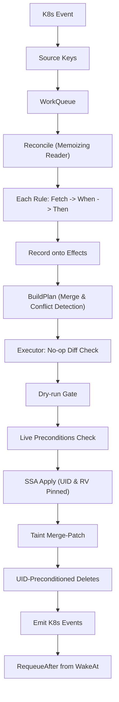

# Donor Controller

The donor controller manages real node sharing and virtual node lifecycle for time-slicing workloads. When donor pods bind to a node, the controller marks the node as shared and joins its time-slicing groups (**W1/W2**). While virtual nodes or guests remain, sharing is held active (**W3 hold**). Once empty, an idle clock tracks elapsed time until expiration (**W3 idle-clock**), after which sharing labels, annotations, and taints are cleanly released (**W3 unshare**). If a backing host node is deleted while its virtual node remains, the controller garbage-collects the orphaned virtual node (**W4 VN GC**).

## Architecture & Layers

Responsibility is split into three strict layers with explicit write boundaries:

1. **`policy`** (`pkg/donor-controller/policy`): Pure rules declaring desired cluster state. Reads only via read-only `rulekit.Reader`. Pure `When`/`Then` functions over `*hostData`. Never writes or imports clientsets.
2. **`rulekit`** (`pkg/donor-controller/internal/rulekit`): Pure declarative API definitions (`Rule`, `Func`, `Source`, `Reader`, `Effects`, `Precondition`). Writer-free contract.
3. **`rulekit/ctrl`** (`pkg/donor-controller/internal/rulekit/ctrl`): Generic engine running on `controller-runtime`. The **only** package permitted to write to the Kubernetes API server.

## Data Flow



## Ownership Model: Release by Omission

Rules never say "remove". Each reconcile computes the **complete** desired
state for the key: the merge of every fired rule's `Effects`. The engine
server-side applies that merge as field manager
`timeslice-donor-controller` against every object declared in
`Controller.Owns`, so any field the controller owned last time but no rule
asserts this time is released by the apiserver. Fields owned by other
managers (hand-applied labels, kubelet, cloud provider) are never touched.
That is why `W3/unshare` only records a precondition: when nothing fires,
the desired state is identity-only and the labels and annotation go away.
Taints are the exception (`spec.taints` is an atomic list), so they are
declared per key in `Controller.ManagedTaints` and reconciled with a
read-modify-write merge patch: present iff some rule asserted them.

Two rules asserting different values for the same field is a policy bug:
`BuildPlan` fails with both rule IDs and the field path, and nothing is
written. Every write emits a Kubernetes Event (`Applied`, `Tainted`,
`Untainted`, `Deleted`) naming the rules that caused it.

## Core Invariants

- **Level-triggered**: Sources signal *when* to reconcile a key; rules determine *what* to do based on full snapshot state.
- **Triggers enqueue keys only**: Informer events carry no payload to rules.
- **Repeatable reads**: Memoized reader ensures all rules in a reconcile cycle observe a single consistent snapshot.
- **Cache-only reads in rules**: `Fetch` never performs network I/O or bypasses the cache.
- **Live reads only in preconditions**: Direct API calls are restricted to pre-apply verification guards (`Precondition`).
- **Undeclared reads error**: Accessing unindexed fields or unmonitored kinds produces explicit runtime errors.
- **Purity test enforced**: `TestPurity` guarantees `policy` never imports writer or controller-runtime execution packages.

## Rule Table

| ID | When | Then |
|---|---|---|
| `W1/W2` | `!IsVirtual && Node != nil && donorsPresent` | `keepShared` (labels `{donor:true, groups...}`, taint if configured) |
| `W3/hold` | `!IsVirtual && Node != nil && !donorsPresent && eraActive && vnBusy` | `keepShared` (clock reset: no idle annotation) |
| `W3/idle-clock` | `!IsVirtual && Node != nil && eraActive && empty && now < idleSince+TTL` | `keepShared` + `Apply({AnnotationIdleSince: idleSince})` + `WakeAt(idleSince+TTL)` |
| `W3/unshare` | `!IsVirtual && Node != nil && eraActive && empty && now >= idleSince+TTL` | `Require(NoDonorPodsOn{host})`; release labels/annotation/taint (implicit) |
| `W4` | `!IsVirtual && Node == nil && VNode != nil` | `Delete(VNode)`; `Require(NodeAbsent{host})` |

## How to Add a Rule

1. Add any necessary fields to `hostData` in `host.go` if new cluster state must be observed.
2. Define a predicate method on `*hostData` if reusable across rules.
3. Add a new `rulekit.Func[*hostData]` entry to `Rules(cfg)` in `rules.go`.
4. Document the rule in the table doc-comment above `Rules(cfg)`.
5. Add test coverage in `rules_test.go` and `gather_test.go`.

```go
rulekit.Func[*hostData]{
    Name:    "W9/custom-rule",
    Watches: hostSources(),
    Fetch:   fetch,
    When:    func(d *hostData) bool { return d.someCondition() },
    Then:    func(d *hostData, fx *rulekit.Effects) { fx.Apply(...) },
}
```

## Operational Notes

- **Virtual Node ProviderID**: GKE's cloud-controller-manager deletes virtual nodes lacking a valid backing VM unless `spec.providerID` starts with `virtual-kubelet://<name>`.
- **Pod Cache Memory**: Pod selectors cannot evaluate `OR` between donor and guest labels. All pods are cached, but trimmed via `policy.TrimPod` to keep only essential metadata, nodeName, and phase.
- **Leader Election**: Enabled via `--leader-elect` using lease `donor-controller.timeslice.io` with `LeaderElectionReleaseOnCancel=true`.
